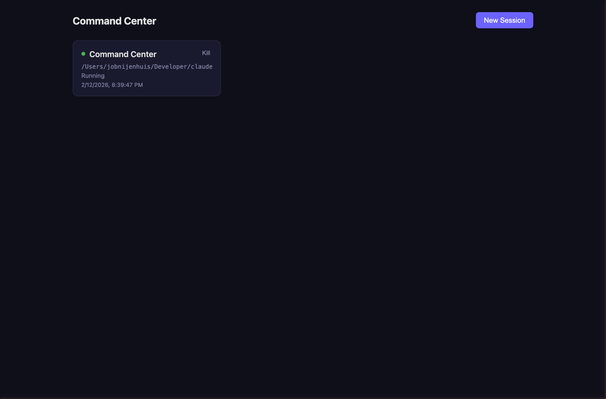
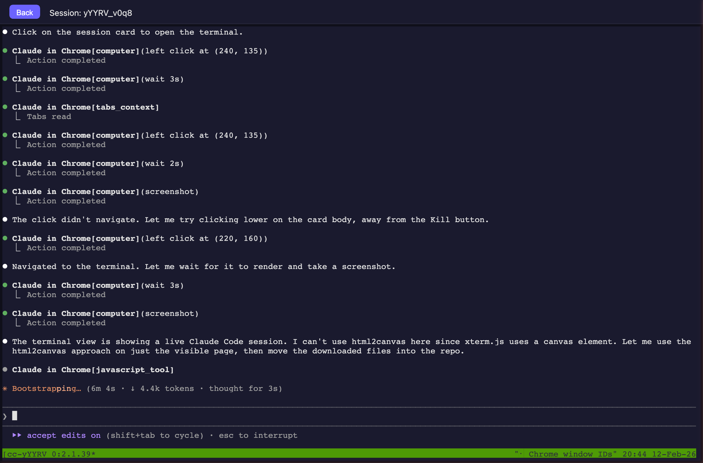
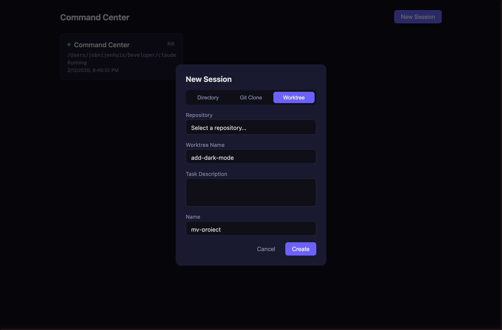

# Claude Command Center

A web-based command center for managing [Claude Code](https://docs.anthropic.com/en/docs/claude-code) CLI sessions through your browser. Spawn, monitor, and interact with multiple sessions from any device.

Built to run on a home server (e.g. Mac Mini) and accessed remotely over [Tailscale](https://tailscale.com).



## Features

- **Multi-session management** — create, monitor, and kill sessions from a dashboard
- **Browser-based terminal** — full xterm.js terminal with color, resize, and clickable links
- **Git worktree workflow** — clone repos, create feature worktrees, and assign tasks to Claude
- **Dashboard grouping** — sessions are grouped by repository for easy navigation
- **Durable sessions via tmux** — sessions survive server restarts; SSH in and `tmux attach` as fallback
- **Dual transport** — WebSocket with automatic SSE fallback for slow/unreliable networks
- **Status detection** — polls tmux pane content to show session state (idle, running, waiting)
- **Quick actions** — approve, reject, or send custom input to sessions without opening the terminal
- **Push notifications** — get notified on your phone when Claude needs input (via ntfy)
- **Simple auth** — passphrase + signed cookie (designed for use behind Tailscale)
- **Mobile-friendly** — responsive layout, works on iPhone Safari

## Screenshots

### Terminal

Click a session card to open a full browser-based terminal powered by xterm.js.



### Session templates

Create sessions in three ways:

**Directory** — point Claude at any directory on your server.

**Git Clone** — clone a repo into a worktree-friendly structure (`repo/repo-main/`) and start Claude in it.


**Worktree** — select a previously cloned repo, name a feature branch, and optionally describe the task. Claude starts in a new git worktree and receives your task description as its initial prompt.



## Architecture

```
Browser (MacBook / iPhone over Tailscale)
    │
    ├── HTTP: REST API + SSE fallback
    └── WebSocket: live terminal
    │
Server (Node.js + Express)
    │
    ├── SQLite: session metadata
    ├── node-pty: terminal bridge
    └── tmux: session backend (durable)
```

## Prerequisites

- **Node.js** 20+ (tested with 23)
- **tmux** (`brew install tmux`)
- **Claude Code** CLI installed and authenticated
- **Tailscale** (for remote access)

## Setup

```bash
git clone https://github.com/Afstkla/claude-command-center.git
cd claude-command-center

# Install dependencies
npm install
cd frontend && npm install && cd ..

# Configure
cp .env.example .env
# Edit .env — set AUTH_PASSPHRASE and AUTH_SECRET
```

### Environment variables

| Variable | Description | Default |
|----------|-------------|---------|
| `PORT` | Server port | `3100` |
| `AUTH_PASSPHRASE` | Login passphrase | (required) |
| `AUTH_SECRET` | JWT signing key (min 32 chars) | (required) |
| `COOKIE_MAX_AGE_HOURS` | Auth cookie expiry | `24` |

## Running

### Development

```bash
npm run dev
# Backend: http://localhost:3100
# Frontend: http://localhost:5173 (proxies API to backend)
```

### Production

```bash
npm run build
npm start

# Or use pm2 for process management:
npm install -g pm2
pm2 start "npx tsx server/index.ts" --name command-center --cwd $(pwd)
pm2 startup  # Auto-start on boot
pm2 save
```

## Tailscale setup

1. Install [Tailscale](https://tailscale.com/download) on your server and client devices
2. Run `tailscale up` on both
3. Find your server's Tailscale IP: `tailscale ip -4`
4. Access the command center at `http://<tailscale-ip>:3100`

No HTTPS needed — Tailscale encrypts all traffic via WireGuard. No port forwarding, no public exposure.

### Why Tailscale?

- Zero-config VPN: devices authenticate via your identity provider
- WireGuard encryption: all traffic is end-to-end encrypted
- No open ports: your server is never exposed to the public internet
- Works everywhere: train wifi, coffee shop, mobile data

## Usage

1. Open `http://<tailscale-ip>:3100` and enter your passphrase
2. Click **New Session** and choose a template:
   - **Directory** — pick a folder and start Claude in it
   - **Git Clone** — clone a repo (creates `repo/repo-main/` structure for worktree support)
   - **Worktree** — create a feature branch worktree from an existing repo, with an optional task prompt
3. Click a session card to open the terminal
4. Use quick action buttons on session cards to approve, reject, or send input without opening the terminal

### Git worktree workflow

The worktree workflow lets you run multiple Claude sessions on the same repo without conflicts:

1. **Clone a repo** using the Git Clone template — this creates a `repo/repo-main/` directory structure
2. **Create worktrees** using the Worktree template — each gets its own branch (`feat/<name>`) and directory
3. **Assign tasks** via the Task Description field — Claude receives it as its first prompt after startup
4. **Clean up** — killing a worktree session automatically removes the git worktree

Sessions from the same repo are grouped together on the dashboard.

### Session durability

Sessions run inside tmux. If the server crashes or restarts:
- Sessions keep running in tmux
- The server reconnects to them on startup
- You can always SSH in and run `tmux ls` / `tmux attach -t cc-<id>`

## Push notifications

Get notified on your phone when Claude needs tool approval or wants your input. Uses [ntfy](https://ntfy.sh) for push delivery.

### Setup

Add ntfy config to your `.env`:

```bash
NTFY_ENABLED=true
NTFY_URL=https://ntfy.sh        # or your self-hosted instance
NTFY_TOPIC=your-secret-topic
NTFY_AUTH_TOKEN=your-token       # optional, for private topics
BASE_URL=http://<tailscale-ip>:3100
```

Then run the setup scripts:

```bash
# MCP server — gives Claude notify_user/ask_user tools
./scripts/setup-mcp.sh

# Notification hook — alerts you on tool approval prompts
./scripts/setup-hooks.sh
```

Both scripts configure Claude Code at the **user level** (`~/.claude.json` and `~/.claude/settings.json`), so notifications work across all sessions and projects. Restart any running Claude Code sessions to pick up the changes.

## Tech stack

| Component | Technology |
|-----------|-----------|
| Backend | Node.js, Express, TypeScript |
| Frontend | React 19, Vite, TypeScript |
| Terminal | xterm.js, node-pty |
| Session backend | tmux |
| Database | SQLite (better-sqlite3) |
| Auth | JWT via jose |

## License

MIT
